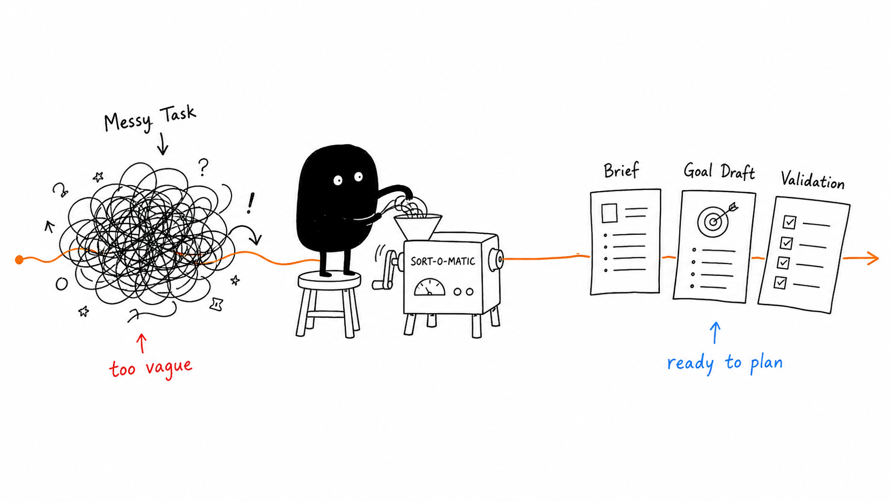
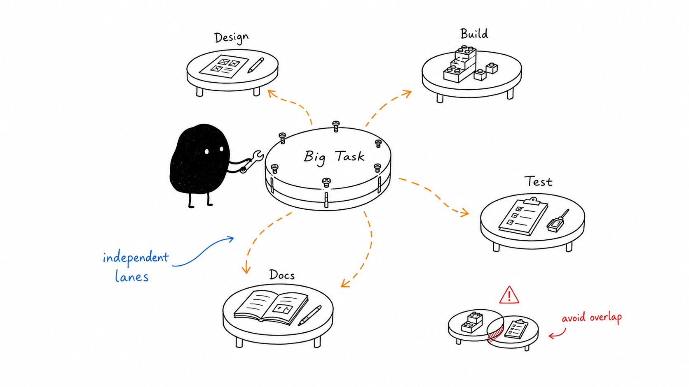
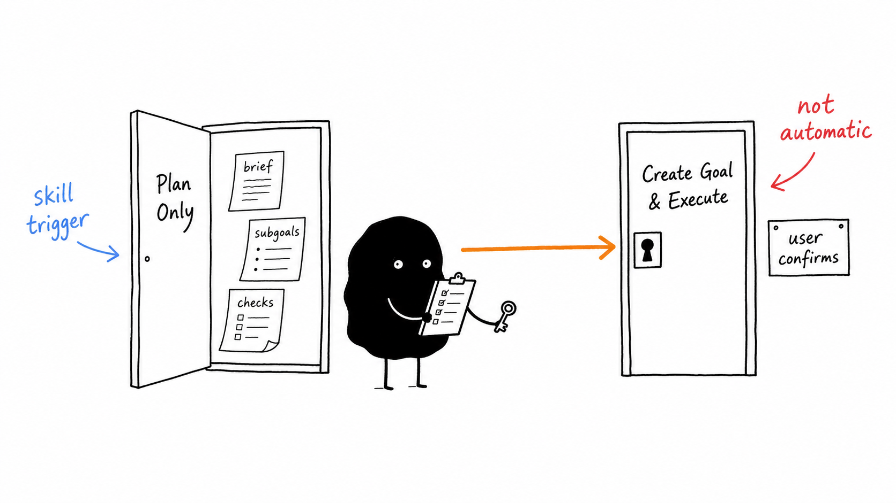

# codex-goals-for-a-task

> A Codex Skill that turns a messy task request into an execution brief, a goal draft, and parallel sub-goals before any real execution starts.

> 一个面向 Codex 的 Skill：先把模糊任务整理成执行简报、goal 草稿和并行子目标，再决定是否真正执行。



## Language Guide

| Language | Section |
| --- | --- |
| 🇬🇧 English | [Overview](#-english-overview) |
| 🇨🇳 中文 | [中文说明](#-中文说明) |
| 🇯🇵 日本語 | [日本語説明](#-日本語説明) |
| 🇰🇷 한국어 | [한국어 설명](#-한국어-설명) |

## 🇬🇧 English Overview

`codex-goals-for-a-task` is a planning-first Codex Skill. It helps Codex turn a vague or multi-part user request into a clear execution package:

- a filled execution brief,
- a top-level Codex goal draft,
- measurable success criteria,
- expected deliverables,
- validation checks,
- bounded sub-goal prompts for parallel agents.

The most important rule is simple:

> **Skill trigger does not automatically create a Codex goal.**

The Skill creates the plan first. A real Codex goal is created only when the user explicitly asks for it.

### Why It Helps

| Advantage | What it means |
| --- | --- |
| Clear planning boundary | Triggering the Skill creates a plan, not an automatic execution. |
| Safer Codex goals | Goal creation happens only after explicit user confirmation. |
| Better parallel work | Sub-goals include context, deliverables, boundaries, and validation. |
| Easier synthesis | The main agent compares agent output against source context before using it. |
| Less scope creep | Unrelated refactors and unverified claims are rejected by default. |



### Workflow

```text
Messy Task
  -> Execution Brief
  -> Goal Draft
  -> Parallel Sub-goals
  -> User Confirmation
  -> Create Goal & Execute
```

### How To Use

Install the Skill into your Codex skills directory:

```bash
mkdir -p "$HOME/.codex/skills/codex-goals-for-a-task"
cp skills/codex-goals-for-a-task/SKILL.md "$HOME/.codex/skills/codex-goals-for-a-task/SKILL.md"
```

Ask Codex to plan first:

```text
Use codex-goals-for-a-task to turn this project into an execution brief and parallel sub-goals. Do not create a real goal yet.
```

After reviewing the plan, explicitly ask Codex to create and execute the goal:

```text
Create the Codex goal from this brief and execute it.
```



### Example Output

```text
Brief:
Build a focused implementation plan for the requested project. Include core deliverables, behavior expectations, quality constraints, and validation steps.

Top-level goal:
Create a complete execution brief and independent sub-goal prompts for the project.

Success criteria:
- The brief has no unresolved placeholders.
- Sub-goals are independent or explicitly marked as sequential.
- Each sub-goal includes context, deliverables, boundaries, and validation.
- The final plan states whether a real Codex goal has been created.

Validation:
- Check that the plan matches the repository context.
- Verify that no execution, file mutation, or agent dispatch happens unless requested.
```

## 🇨🇳 中文说明

`codex-goals-for-a-task` 是一个“先规划、再执行”的 Codex Skill。它会帮助 Codex 把模糊或复杂的用户请求整理成：

- 填写完整的执行简报；
- 顶层 Codex goal 草稿；
- 可衡量的完成标准；
- 预期交付物；
- 验证步骤；
- 可并行处理、边界清楚的子目标提示。

最重要的规则是：

> **触发 Skill 不等于自动创建 Codex goal。**

这个 Skill 默认只生成计划。只有当用户明确说“创建 goal”“开启 goal”“用 goal 执行”时，才进入真实 goal 创建和执行。

### 它的优势

| 优势 | 说明 |
| --- | --- |
| 规划边界清楚 | 触发 Skill 只生成计划，不自动执行。 |
| 执行更安全 | 真实 goal 创建需要用户明确确认。 |
| 并行更稳定 | 子目标包含上下文、交付物、边界和验证要求。 |
| 综合更可靠 | 主代理会把代理结果和项目上下文核对后再采用。 |
| 减少范围漂移 | 默认拒绝无关重构和未经验证的结论。 |

### 中文使用示例

先生成计划：

```text
用 codex-goals-for-a-task 帮我把这个项目生成执行简报和并行子目标。先不要创建真实 goal。
```

确认计划后再执行：

```text
根据这个简报创建 Codex goal 并执行。
```

## 🇯🇵 日本語説明

`codex-goals-for-a-task` は、Codex のための「計画を先に作る」Skill です。曖昧な依頼や複数の作業を含むタスクを、実行しやすい構造に整理します。

この Skill が作るもの：

- 実行ブリーフ；
- Codex goal の下書き；
- 測定可能な成功条件；
- 期待される成果物；
- 検証ステップ；
- 並列エージェント向けの独立したサブゴール。

重要なルール：

> **Skill が起動しても、Codex goal は自動作成されません。**

まず計画だけを作ります。実際の goal 作成と実行は、ユーザーが明示的に依頼した場合だけ行います。

### 利点

| 利点 | 内容 |
| --- | --- |
| 計画と実行を分離 | Skill の起動は計画作成であり、自動実行ではありません。 |
| 安全な goal 作成 | goal 作成はユーザーの明示的な確認後に行います。 |
| 並列作業に強い | 各サブゴールに文脈、成果物、境界、検証を含めます。 |
| 統合しやすい | エージェントの結果をソース文脈と照合してから採用します。 |
| スコープ拡大を防ぐ | 不要なリファクタや未検証の主張を避けます。 |

### 日本語での使い方

計画だけを作る：

```text
codex-goals-for-a-task を使って、このプロジェクトを実行ブリーフと並列サブゴールに整理してください。まだ実際の goal は作成しないでください。
```

計画を確認してから実行する：

```text
このブリーフから Codex goal を作成して実行してください。
```

## 🇰🇷 한국어 설명

`codex-goals-for-a-task`는 Codex를 위한 “계획 우선” Skill입니다. 모호하거나 여러 단계로 나뉜 요청을 실행 가능한 구조로 정리합니다.

이 Skill이 만들어 주는 것:

- 실행 브리프；
- Codex goal 초안；
- 측정 가능한 성공 기준；
- 예상 산출물；
- 검증 단계；
- 병렬 에이전트를 위한 독립적인 하위 목표 프롬프트.

가장 중요한 규칙:

> **Skill이 실행되었다고 해서 Codex goal이 자동으로 생성되지는 않습니다.**

먼저 계획만 만듭니다. 실제 goal 생성과 실행은 사용자가 명시적으로 요청한 경우에만 진행합니다.

### 장점

| 장점 | 설명 |
| --- | --- |
| 계획과 실행 분리 | Skill 실행은 계획 생성이며 자동 실행이 아닙니다. |
| 더 안전한 goal 생성 | 실제 goal은 사용자의 명시적 확인 후에만 생성됩니다. |
| 병렬 작업에 적합 | 각 하위 목표에 맥락, 산출물, 경계, 검증을 포함합니다. |
| 결과 통합이 쉬움 | 에이전트 결과를 소스 맥락과 비교한 뒤 사용합니다. |
| 범위 확장 방지 | 관련 없는 리팩터링과 검증되지 않은 주장을 기본적으로 거부합니다. |

### 한국어 사용 예시

먼저 계획만 만들기:

```text
codex-goals-for-a-task를 사용해서 이 프로젝트를 실행 브리프와 병렬 하위 목표로 정리해 주세요. 아직 실제 goal은 만들지 마세요.
```

계획 확인 후 실행하기:

```text
이 브리프를 바탕으로 Codex goal을 생성하고 실행해 주세요.
```

## Repository Contents

```text
skills/codex-goals-for-a-task/SKILL.md
assets/images/
README.md
LICENSE
```

## License

MIT
